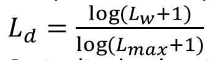
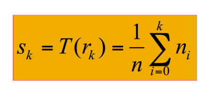
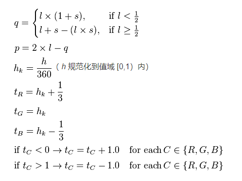

# 目标
## 一. 实现Light的对数调整
## 二. 直方图均衡

# 实验步骤

## 1.读入一张图片
## 2.将图片转成HSL颜色空间 
## 3.统计明度最大最小值
## 4.改变图像的Lightness值

## 5.转回RGB，输出一张图片，完成目标一
## 6.统计明度的分布
## 7.对每一个明度，计算均衡后对应的明度，存成表格
## 8.遍历像素，根据明度对应表改变亮度
## 9.转回RGB，输出一张图片，完成目标二

***
# 补充
## RGB转HSL步骤
### 1. 寻找rgb三个通道的最大和最小者
### 2. 单位化，统一除以颜色深度
### 3. 计算h,s,l

## HSL转RGB步骤
### 1. 确定定义域（H溢出报错，S溢出报错，L溢出拉到全白L=1）
### 2. 特判：$s=0$,全灰, $r_o = g_o = b_o = L$
### 3. $s \neq 0$, 使用以下公式计算

