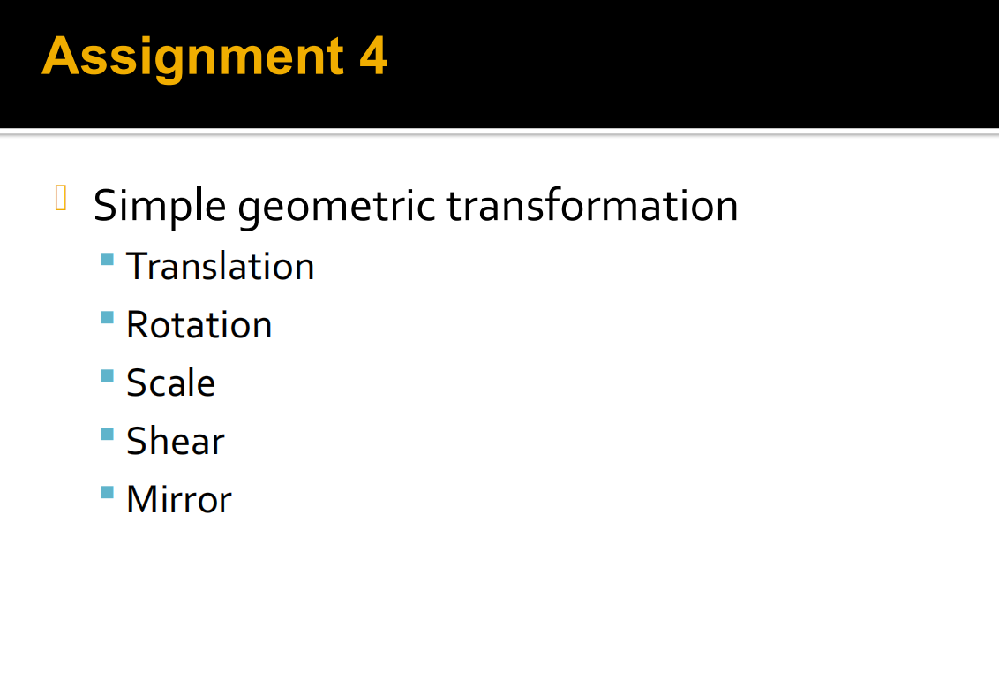

# 目标
## 一、对图像实现平移（一部分）
## 二、对图像实现旋转
## 三、对图像实现缩放
## 四、对图像实现剪切
## 五、对图像实现镜像

+ 希望学习引用库，以线性代数的计算库为例

# 流程
## 一、读入一个图像
## 二、复制这个图像
## 三、对这个图像的像素逐个处理
+ **计算变换的逆矩阵**
+ **找到原图像的位置**
+ **判断是否越界，越界则以白色像素代替**
+ **x，y两个小数点，尝试做二维的RBF插值，测试函数设置为线性[创建数组来实现后续调整]**
+ **得到最终的像素值并赋值**
## 四、输出这个图像

需要准备的：
引入线性代数计算库
三维向量的class定义
变换矩阵的class定义
RBF备用函数库